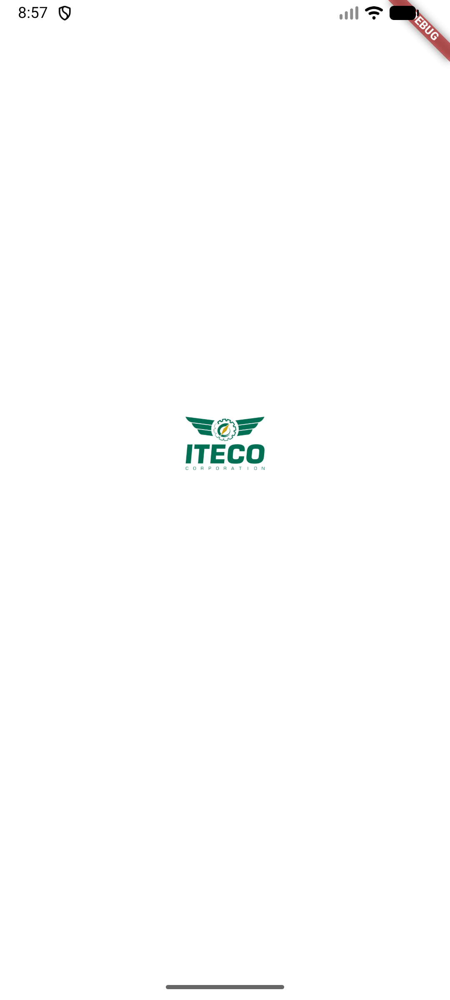
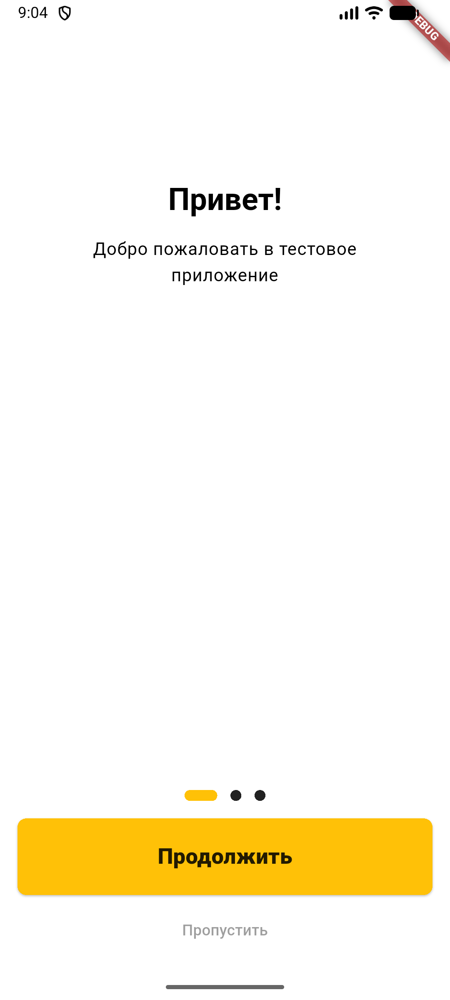

# Тестовое приложение
## Изображения

<p align="center">
  
  
  
</p>

## Установка и запуск проекта

### Предварительные требования

- Установлен Flutter SDK (см. официальную документацию по установке для вашей ОС).
- Установлен Git.
- Установлена IDE (Android Studio, VS Code, IntelliJ IDEA) или возможность запускать команды из терминала.
- Настроенные эмулятор/симулятор или реальное устройство (Android / iOS).

### Клонирование репозитория
```
git clone https://github.com/Drimkaa/TestProjectFlutter.git
cd TestProjectFlutter
```
### Установка зависимостей
```
flutter pub get
```
### Запуск приложения в режиме разработки (debug)
```
flutter run
```
Команда автоматически найдёт подключённое устройство или эмулятор и запустит приложение.

### Запуск в режиме release (Android)
```
flutter run --release
```

Или собрать APK:
```
flutter build apk --release
```
APK будет лежать по пути:
```
build/app/outputs/flutter-apk/app-release.apk
```
Его можно установить на устройство вручную или через `adb install`.
